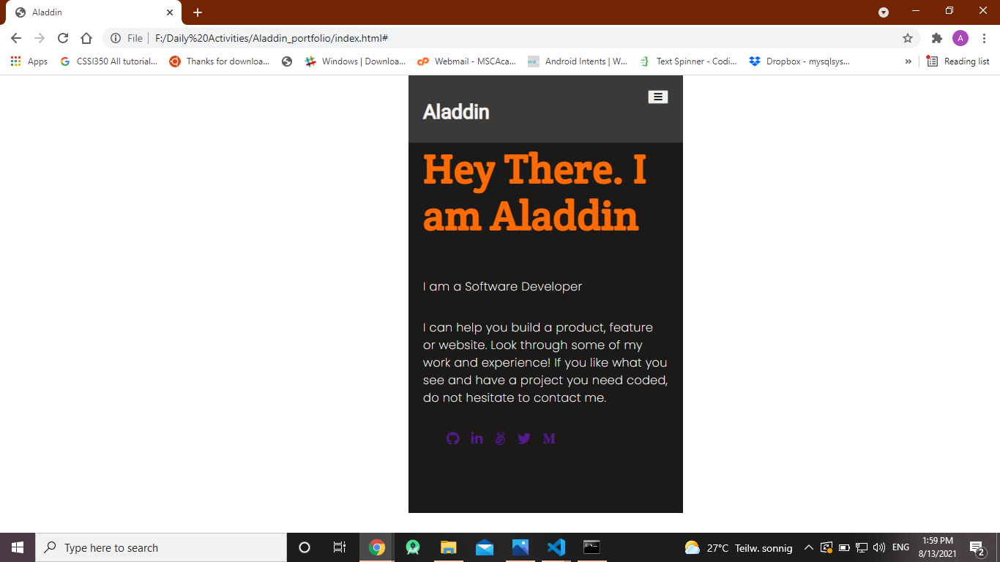

# Aladdin's Portfolio

> This project is personal portfolo for Aladdin.

## Built With

- HTML
- CSS

## Getting Started

**I just created the project from scratch, starting from initilizing the index page with the navigation bar, main section structure, then I've choosed the Styling , like the background and the clolors, I used flex property to manage the ordering of the elements.**

## Authors

👤 **Aladdin**

- GitHub: [@githubhandle](https://github.com/AlaaAlsalem)
- LinkedIn: [LinkedIn](https://www.linkedin.com/in/aladdin-alsalem-5a68ba1a0/)

## 🤝 Contributing

Contributions, issues, and feature requests are welcome!

## 📝 License

This project is [MIT](./MIT.md) licensed.
